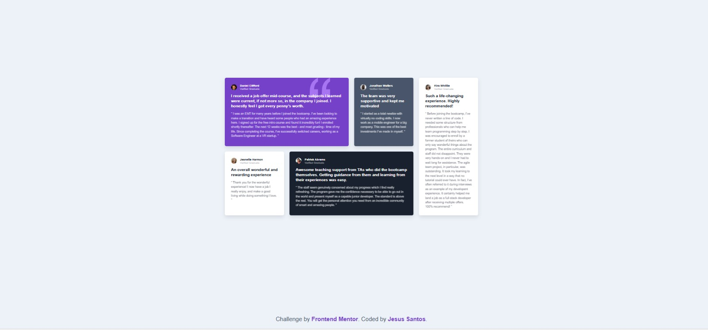

# Frontend Mentor - Testimonials grid section solution

This is a solution to the [Testimonials grid section challenge on Frontend Mentor](https://www.frontendmentor.io/challenges/testimonials-grid-section-Nnw6J7Un7). Frontend Mentor challenges help you improve your coding skills by building realistic projects. 

## Table of contents

- [Overview](#overview)
  - [The challenge](#the-challenge)
  - [Screenshot](#screenshot)
  - [Links](#links)
- [My process](#my-process)
  - [Built with](#built-with)
  - [What I learned](#what-i-learned)
  - [Continued development](#continued-development)
- [Author](#author)

## Overview

### The challenge

Users should be able to:

- View the optimal layout for the site depending on their device's screen size.

### Screenshot



### Links

- Solution URL: [GitHub Repository](https://github.com/jesussantos210/testimonials-grid-section)
- Live Site URL: [Github Live Site](https://jesussantos210.github.io/testimonials-grid-section)

## My process

### Built with

- Semantic HTML5 markup
- CSS custom properties
- CSS Grid (Complex Layouts)
- Mobile-first workflow

### What I learned

This project was a deep dive into **CSS Grid placement**. I learned how to rearrange items visually without changing the HTML structure using `nth-child` selectors.

The biggest challenge was creating the "bento box" layout where some cards span across multiple columns or rows.

Here is the code I used to make the first testimonial span 50% of the width (2 columns) and the last one span full height:

```css
/* Making the first card wide */
.card:nth-child(1) {
  grid-column: span 2;
}

/* Making the last card tall (Kira) */
.card:nth-child(5) {
  grid-column: 4;
  grid-row: 1 / span 2;
}
```
## Continued development
I want to continue practicing responsive layouts where the grid structure changes completely between mobile (1 column) and desktop (4 columns).

# Author
Website - [Jesus Santos](https://github.com/jesussantos210)

Frontend Mentor - [@jesussantos210](https://www.frontendmentor.io/profile/jesussantos210)